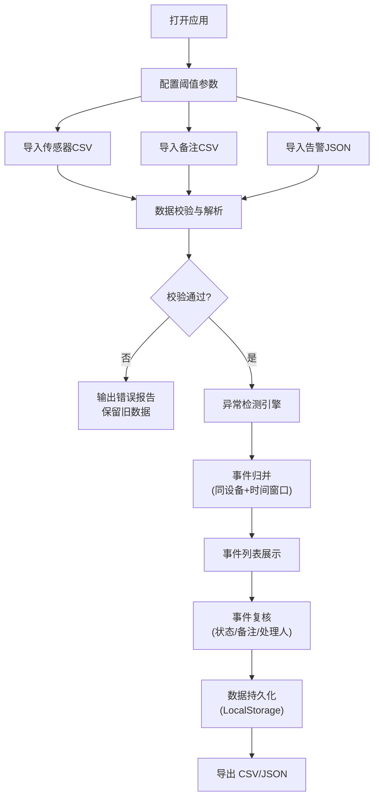

## 1. 产品概述

本地巡检日志分析看板是一款面向运维人员的桌面级数据分析工具，用于导入传感器数据、人工备注和告警信息，通过配置阈值自动识别异常事件并归并相关证据，支持事件复核流程和多格式导出。

- **核心价值**：将分散的多源巡检数据智能归并，提供统一的事件复核工作台，提升异常排查效率
- **目标用户**：设备运维人员、巡检工程师、数据分析员
- **使用场景**：日常巡检数据分析、异常事件复核归档、巡检报告生成

## 2. 核心功能

### 2.1 用户角色

| 角色 | 注册方式 | 核心权限 |
|------|----------|----------|
| 运维用户 | 本地使用，无需注册 | 数据导入、阈值配置、事件复核、数据导出 |

### 2.2 功能模块

1. **数据导入模块**：支持传感器 CSV、人工备注 CSV、告警 JSON 三种格式导入，含导入校验和错误报告
2. **阈值配置模块**：温度、电压、离线时长、合并窗口四项可配置阈值
3. **异常检测模块**：基于阈值自动识别异常证据，按设备和时间窗口归并为事件
4. **事件管理模块**：事件列表、详情查看、状态流转（待处理/已确认/误报/已关闭）
5. **数据导出模块**：支持 CSV 和 JSON 格式导出事件及证据数据
6. **数据持久化**：本地存储所有数据，重启后状态一致

### 2.3 页面详情

| 页面名称 | 模块名称 | 功能描述 |
|-----------|-------------|---------------------|
| 主看板 | 概览统计 | 展示事件总数、各状态数量、设备数量等关键指标 |
| 主看板 | 数据导入区 | 拖拽/点击上传三种数据文件，显示导入进度和错误报告 |
| 主看板 | 阈值配置面板 | 温度上下限、电压上下限、离线时长、合并窗口的配置与保存 |
| 主看板 | 事件列表 | 分页展示事件，支持按状态、设备、时间筛选 |
| 主看板 | 事件详情抽屉 | 展示事件时间线、证据列表、处理记录、备注编辑 |
| 主看板 | 导出操作栏 | 选择导出格式和范围，一键下载 |

## 3. 核心流程

### 3.1 主业务流程

用户打开应用 → 配置检测阈值 → 导入三类数据 → 系统自动检测异常并归并事件 → 用户浏览事件列表 → 打开事件详情复核 → 更新事件状态和备注 → 导出分析结果

### 3.2 流程图

## 4. 用户界面设计

### 4.1 设计风格

- **主色调**：深青蓝色（#0ea5e9）作为主色，代表专业与可靠
- **辅助色**：琥珀色（#f59e0b）表示待处理，翠绿色（#10b981）表示已确认，玫红色（#ef4444）表示告警，灰色（#6b7280）表示已关闭
- **按钮风格**：圆角中等（8px），悬停有轻微上浮和阴影加深效果
- **字体**：系统无衬线字体，标题使用 600 字重，正文使用 400 字重
- **布局风格**：三栏式布局，左侧阈值配置，中间事件列表，右侧事件详情
- **图标风格**：线性图标，与文字颜色一致

### 4.2 页面设计概述

| 页面名称 | 模块名称 | UI 元素 |
|-----------|-------------|----------|
| 主看板 | 顶部导航 | 应用标题、导入按钮、导出按钮、数据统计卡片 |
| 主看板 | 左侧配置区 | 阈值表单、保存按钮、重置按钮、实时生效提示 |
| 主看板 | 中间事件区 | 筛选器（状态/设备/时间）、事件卡片列表、分页 |
| 主看板 | 右侧详情区 | 事件标题、状态标签、时间线、证据列表、操作区 |
| 主看板 | 导入弹窗 | 文件拖拽区、文件类型说明、导入进度、错误列表 |

### 4.3 响应式

- 桌面端（≥1200px）：三栏并列布局
- 平板端（768-1199px）：左右两栏，详情区改为底部抽屉
- 移动端（<768px）：单栏堆叠，详情全屏弹窗

### 4.4 交互细节

- 事件卡片悬停时有边框高亮和轻微阴影
- 状态切换有平滑过渡动画
- 导入过程显示进度条，错误项逐条列出
- 时间线使用垂直连接线连接各证据点
- 数据保存后显示轻量 Toast 提示
