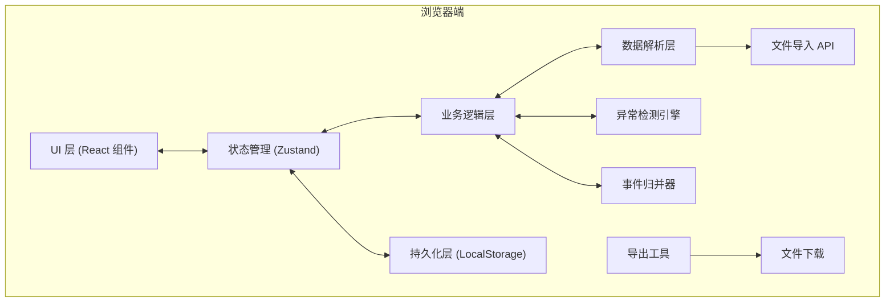
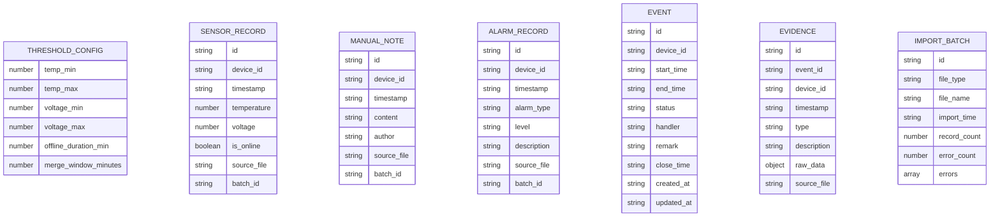

## 1. 架构设计

本项目为纯前端本地应用，所有数据处理和存储均在浏览器端完成，无需后端服务。采用单页应用架构，通过 LocalStorage 实现数据持久化。



## 2. 技术描述

- **前端框架**：React 18 + TypeScript
- **构建工具**：Vite 5
- **样式方案**：Tailwind CSS 3
- **状态管理**：Zustand
- **路由**：React Router DOM（单页面，用于未来扩展）
- **图标库**：Lucide React
- **数据存储**：浏览器 LocalStorage
- **后端**：无（纯前端本地应用）

### 2.1 技术选型说明

- **纯前端架构**：满足"本地"使用需求，用户打开 HTML 即可使用，无需部署
- **LocalStorage**：数据持久化简单可靠，满足中小规模数据需求
- **Zustand**：轻量级状态管理，API 简洁，适合本项目规模
- **Tailwind CSS**：快速构建现代化 UI，保持样式一致性

## 3. 目录结构

```
src/
├── components/          # UI 组件
│   ├── dashboard/       # 看板相关组件
│   │   ├── StatsCard.tsx
│   │   ├── ThresholdPanel.tsx
│   │   ├── EventList.tsx
│   │   ├── EventDetail.tsx
│   │   └── EventTimeline.tsx
│   ├── import/          # 导入相关组件
│   │   ├── ImportModal.tsx
│   │   ├── FileDropzone.tsx
│   │   └── ImportReport.tsx
│   ├── export/          # 导出相关组件
│   │   └── ExportPanel.tsx
│   └── common/          # 通用组件
│       ├── StatusBadge.tsx
│       ├── Toast.tsx
│       └── Modal.tsx
├── hooks/               # 自定义 Hooks
│   ├── useFileImport.ts
│   ├── useEventExport.ts
│   └── useLocalStorage.ts
├── store/               # Zustand Store
│   └── useAppStore.ts
├── utils/               # 工具函数
│   ├── csvParser.ts
│   ├── jsonParser.ts
│   ├── anomalyDetector.ts
│   ├── eventMerger.ts
│   ├── exporter.ts
│   └── validator.ts
├── types/               # TypeScript 类型定义
│   └── index.ts
├── pages/               # 页面
│   └── Dashboard.tsx
├── App.tsx
├── main.tsx
└── index.css
```

## 4. 数据模型

### 4.1 核心数据结构



### 4.2 数据关系说明

- 一个 **Event** 包含多个 **Evidence**（1:N）
- Evidence 的 type 包括：sensor_anomaly, manual_note, alarm
- 所有导入数据都关联一个 **ImportBatch**，用于去重和追踪
- **ThresholdConfig** 是全局单例配置

## 5. 核心算法

### 5.1 异常检测算法

1. **温度异常**：temperature < temp_min 或 temperature > temp_max
2. **电压异常**：voltage < voltage_min 或 voltage > voltage_max
3. **离线异常**：is_online = false 且持续时间超过 offline_duration_min
4. **告警数据**：所有 alarm 记录均视为异常证据

### 5.2 事件归并算法

1. 按 device_id 对所有异常证据分组
2. 对每组证据按时间排序
3. 使用滑动窗口（merge_window_minutes）归并相邻证据：
   - 初始化第一个事件窗口
   - 如果下一个证据与当前窗口结束时间差 ≤ merge_window，则扩展窗口
   - 否则新建窗口
4. 每个窗口生成一个 Event，窗口内所有证据关联到该 Event

### 5.3 导入去重机制

- 每个导入文件生成唯一 batch_id（基于文件名 + 内容哈希）
- 导入前检查 batch_id 是否已存在
- 已存在则跳过该批次，不创建重复事件
- 错误数据不影响旧数据，采用"全部成功或保留旧数据"策略

## 6. 数据校验规则

### 6.1 CSV 格式要求

**传感器 CSV**：
- 必需字段：device_id, timestamp, temperature, voltage, is_online
- 可选字段：无

**备注 CSV**：
- 必需字段：device_id, timestamp, content, author
- 可选字段：无

### 6.2 JSON 格式要求

**告警 JSON**：
- 数组格式，每个元素包含：device_id, timestamp, alarm_type, level, description
- 或对象格式包含 data 数组

### 6.3 校验失败处理

- 缺少 device_id：报告行号和字段名，跳过该行
- 时间无法解析：报告行号和原始时间字符串，跳过该行
- 阈值配置非法：报告具体字段和当前值，拒绝保存，保留旧配置
- 所有校验错误收集后统一展示，不中断导入流程
- 部分数据有效时，仅导入有效部分，无效部分生成错误报告
